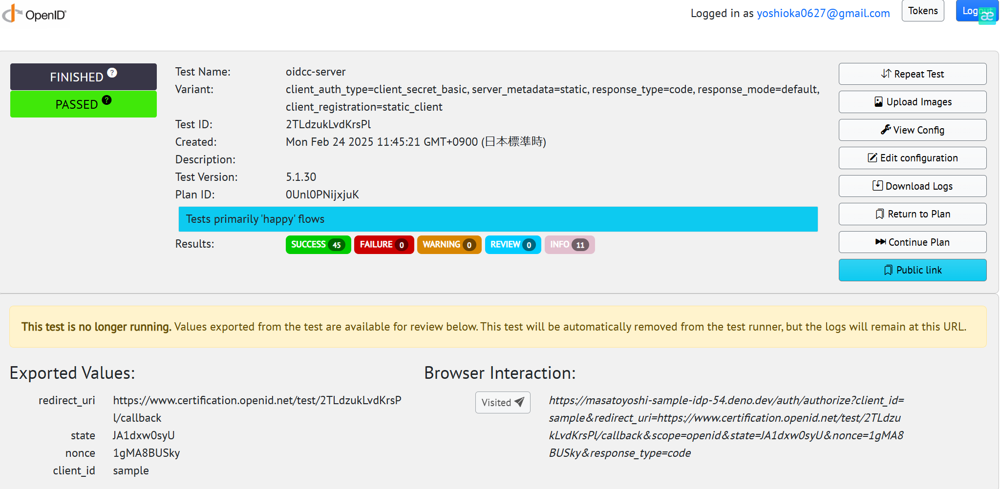

Sample IdProvider
===

This repository contains a sample implementation of an Identity Provider(IDP) using TypeScript.
It includes authentication and authorization features and is built with Deno.

Features:
---

- User authentication using JWT
- Management of authentication codes
- Client authentication
- Only Authorization Code Grand Support

Requirements:
---

- Docker
- Docker Compose

Usage:
---

```sh
docker build -t sample-idp:latest .
docker compose up -d
```

Demo:
---

see: https://masatoyoshi-sample-idp-54.deno.dev

TestCase:
---

OpenId Connect Certification Page: https://www.certification.openid.net/

Simple TestCase Is Passed



License:
---

MIT
